# Отчет о выполнении тестового задания
### **Базовая часть** 

#### **1. Установка и настройка локального кластера**  
- Установить **`kind`** (Kubernetes in Docker)
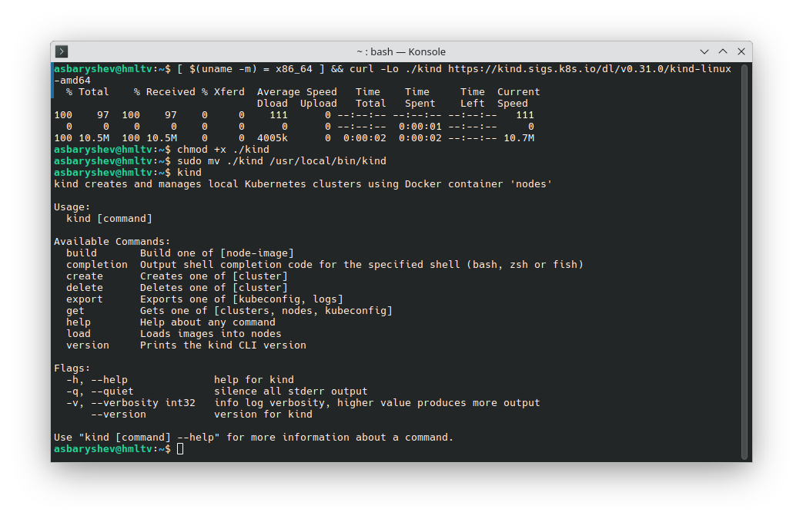
- Запустить кластер и проверить подключение через **`kubectl`**.  
- Убедиться, что `kubectl get nodes` показывает рабочую ноду.
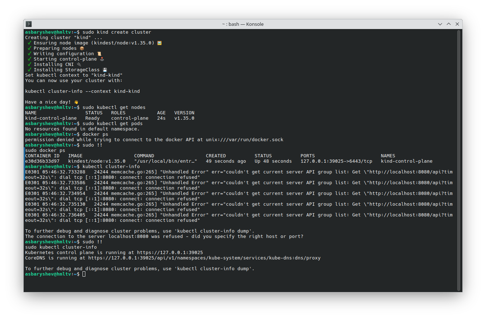
- Выполнить `kubectl get ns`, почитать о концепции namespace в k8s
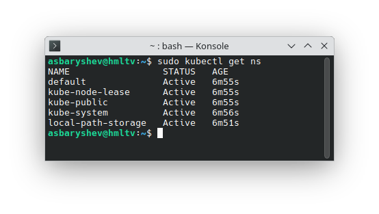
> Namespace или пространство имен — это абстрактный объект, который логически разграничивает и изолирует ресурсы между подами. Можно рассматривать пространство имен как внутренний виртуальный кластер, который поможет изолировать проекты или пользователей между собой, применить разные политики квот на свои проекты или выдать права доступа только на определенную область.
> 
> _default_ — пространство имён по умолчанию для объектов без какого-либо другого пространства имён
> 
> _kube-system_ — пространство имён для объектов, созданных Kubernetes. Там размещаются системные поды кластера
> 
> _kube-public_ — создаваемое автоматически пространство имён, которое доступно для чтения всем пользователям (включая также неаутентифицированных пользователей)
> 
> _kube-node-lease_ — пространство имён, которое используется для управления «арендой» узлов (node leases). Оно появилось в Kubernetes начиная с версии 1.14.
> 
> _local-path-storage_ — пространство имен, используемое для работы с [хранилищами](https://kubernetes.io/docs/concepts/storage/)

- Выполнить `kubectl get po -n kube-system`, ознакомиться с контейнерами запущенными в неймспейсе (что это за контенеры и зачем они нужны).
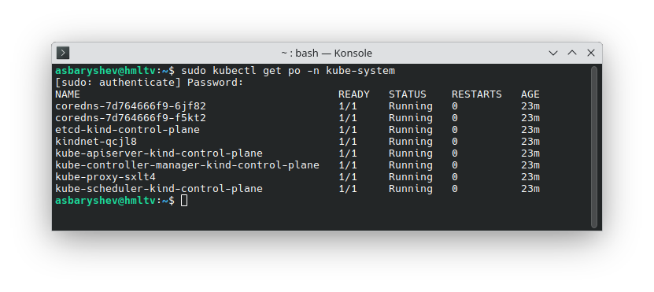
> 1. **CoreDNS** — это стандартная реализация DNS-сервера в Kubernetes (K8s). Это гибкий, расширяемый DNS-сервер, написанный на Go. Используется по умолчанию для разрешения DNS-имен внутри кластера.
>    CoreDNS позволяет управлять запросами DNS для подов и сервисов, а также предоставляет дополнительные возможности, например, настройку правил разрешения имён, кэширование DNS-запросов для повышения производительности, поддержку различных плагинов для расширения функциональности
> 2. **etcd** —  это компонент control plane, распределённое хранилище ключ-значение. Kubernetes использует etcd для хранения всего состояния кластера: манифестов подов, данных о конфигурации и статусах.
> 3. [**Kindnet**](https://github.com/kubernetes-sigs/kindnet) — это простой сетевой плагин для Kubernetes, разработанный для обеспечения производительности и масштабируемости
> 4. **Api Server** — компонент control plane, отвечающий за API Kubernetes. По сути является единственной точкой входа для управления кластером.
> 5. **Controller Manager** — компонент control plane, который отвечает за управление контроллерами, отвечающими за поддержание желаемого состояния кластера. Например, может быть один контроллер, который наблюдает за узлами, другой — за задачами (Jobs), и так далее.
> 6. **Scheduler** — компонент control plane, отвечающий за назначение подов на узлы (ноды) в кластере.
> 7. **Kube-proxy** — это сетевой прокси, который работает на каждом узле в кластере. Он принимает весь трафик, приходящий на узел, и пересылает на правильный под.
> 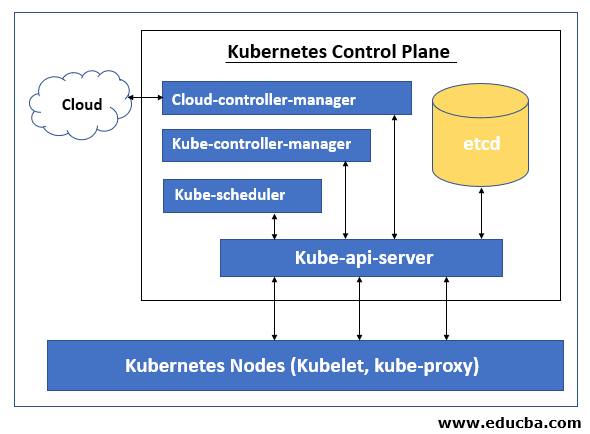

#### **2. Запуск пода с одним и несколькими контейнерами**  
- Создать **Pod** (`kubectl run`) взяв за основу образ https://hub.docker.com/r/jkaninda/simple-api
- Проверить логи  (`kubectl logs <pod> -c <container>`).
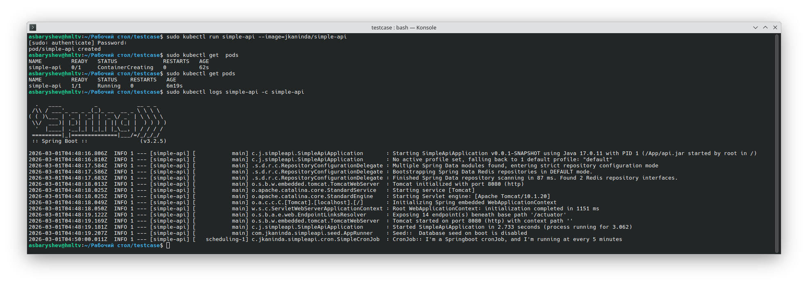

- Получить доступ к api через `kubectl port-forward`
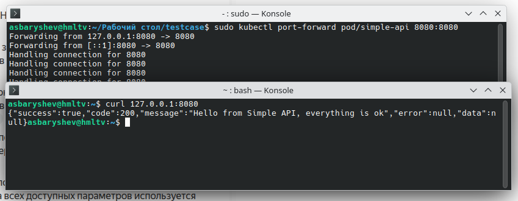
#### **3. Переход на ReplicaSet и Deployment**  
- Заменить **Pod** на **Deployment** (указать `replicas: 2`) (https://hub.docker.com/r/jkaninda/simple-api#:~:text=simple%2Dapi%3Alatest%20.-,Run%20on%20Kubernetes,-Prerequisites)
- Проверить, что при удалении пода он восстанавливается. 
Создадим манифест simple-api-deployment.yaml
```yaml
apiVersion: apps/v1
kind: Deployment
metadata:
  name: simple-api
  namespace: simple-api
spec:
  replicas: 2
  selector:
    matchLabels:
      app: simple-api
  template:
    metadata:
      labels:
        app: simple-api
    spec:
      containers:
      - name: simple-api
        image: jkaninda/simple-api:latest
        resources:
          limits:
            memory: "750Mi"
            cpu: "500m"
        ports:
        - containerPort: 8080
```
Создадим namespace simple-api, установим его в качестве текущего неймспейса, применим манифест simple-api-deployment.yaml, посмотрим текущие поды, попробуем удалить один из них, посмотрим восстановится ли он.
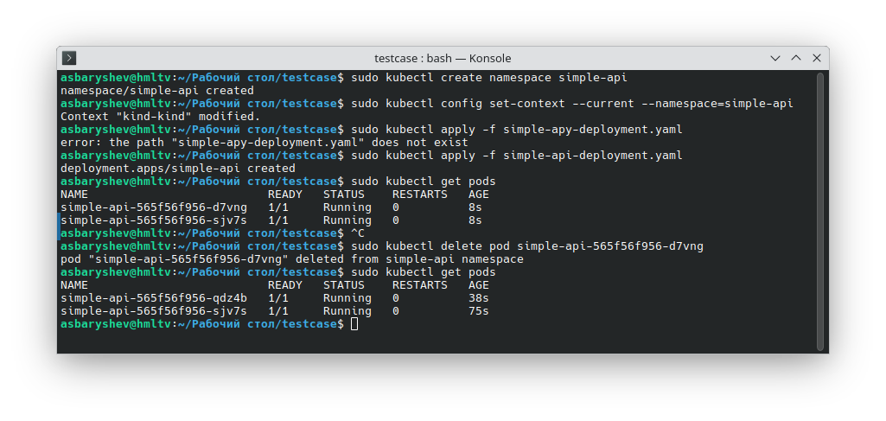
#### **4. Настройка доступа через Service**  
- Создать **Service** типа **ClusterIP** для доступа к поду внутри кластера.  
Создадим манифест simple-api-svc.yaml
```yaml
apiVersion: v1
kind: Service
metadata:
  name: simple-api-svc
  namespace: simple-api
spec:
  selector:
    app: simple-api
  ports:
  - port: 80
    targetPort: 8080
```
Применим манифест, посмотрим создался ли сервис

Также можно было использовать `kubectl expose`
#### **5. Развертывание Ingress-контроллера через Helm**  
- Установить **Helm**.  
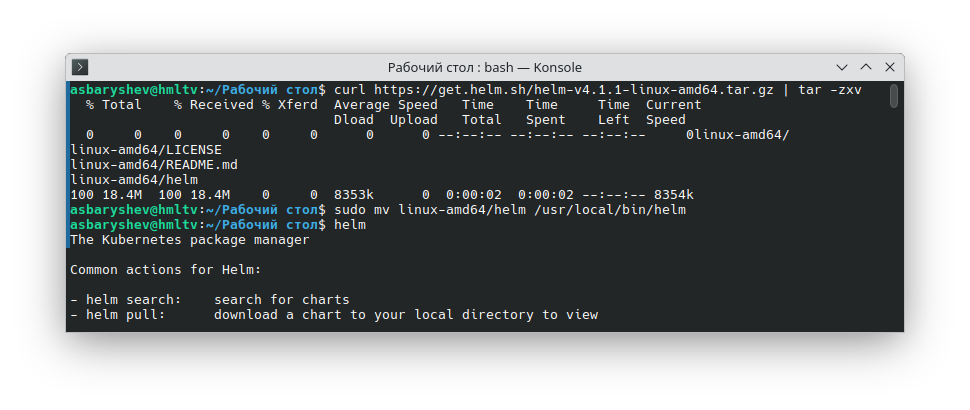
- Добавить репозиторий `ingress-nginx` https://kubernetes.github.io/ingress-nginx (`helm repo add`)
- Установить `ingress-nginx` с **NodePort** (если нет LoadBalancer) через (`helm install`)
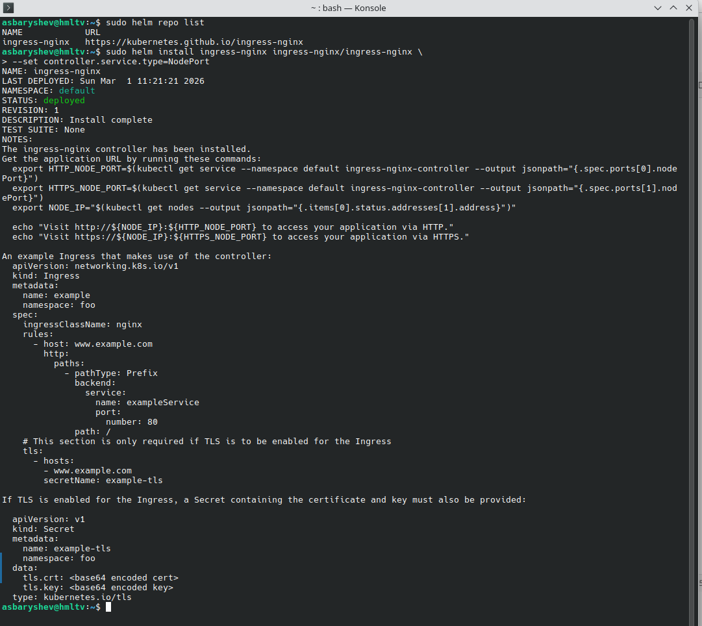
 
 - Создать **Ingress**-ресурс для маршрутизации трафика на сервис c simple-api.
 Создадим манифест для Ingress-ресурса
 ```yaml
apiVersion: networking.k8s.io/v1
kind: Ingress
metadata:
  name: ingress-resource
  namespace: simple-api
spec:
  ingressClassName: nginx
  rules:
  - host: simple-api.com
    http:
      paths:
       - pathType: Prefix
         backend:
          service:
            name: simple-api-svc
            port:
              number: 80
         path: /
 ```
Применим манифест, проверим появился ли Ingress ресурс
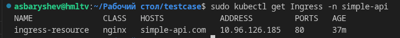
Так как мы используем kind, который запускает ноды как Docker-контейнеры, не пробрасывая при этом порты наружу, а маппинг портов при создании кластера в kind я не предусмотрел, будем использовать `kubectl port-forward`.
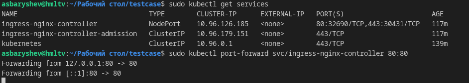
Сделаем запрос на simple-api.com, убедимся, что все действительно работает
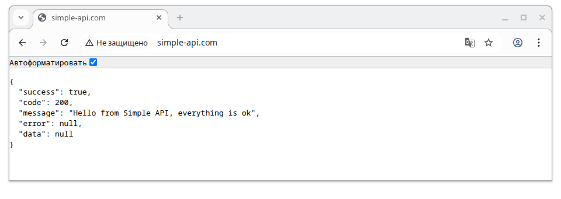
Убедимся, что трафик проксируется именно через ingress-nginx, сделав запрос на localhost, которого в манифесте ingress ресурса нет
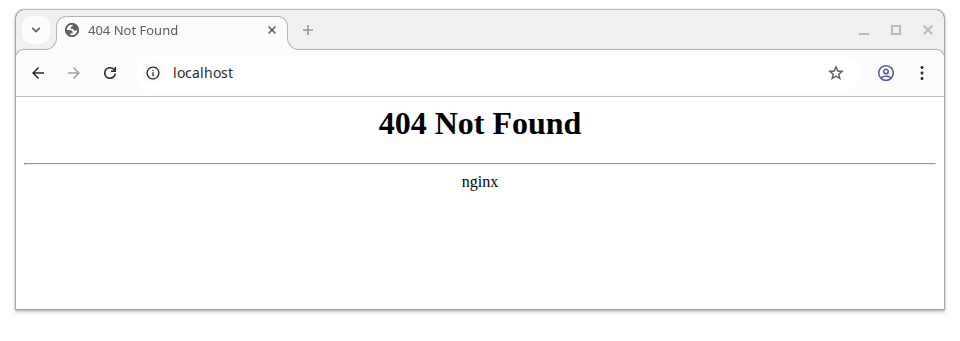
